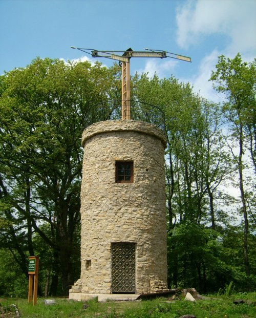

[Email in the 18th century: the optical telegraph](https://www.lowtechmagazine.com/2007/12/email-in-the-18.html)

More than 200 years ago it was already possible to send messages throughout Europe and America at the speed of an aeroplane – wireless and without need for electricity
