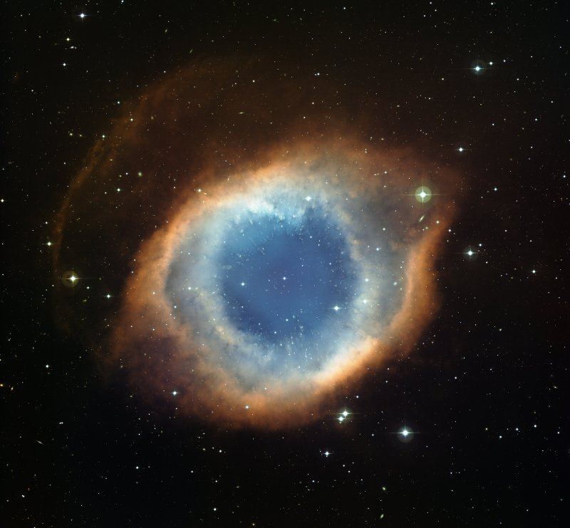

This colour-composite image of the Helix Nebula (NGC 7293) was created from images obtained using the the Wide Field Imager (WFI), an astronomical camera attached to the 2.2-metre Max-Planck Society/ESO telescope at the La Silla observatory in Chile. The blue-green glow in the centre of the Helix comes from oxygen atoms shining under effects of the intense ultraviolet radiation of the 120 000 degree Celsius central star and the hot gas. Further out from the star and beyond the ring of knots, the red colour from hydrogen and nitrogen is more prominent. A careful look at the central part of this object reveals not only the knots, but also many remote galaxies seen right through the thinly spread glowing gas. This image was created from images through blue, green and red filters and the total exposure times were 12 minutes, 9 minutes and 7 minutes respectively. (via [ESO - The Helix Nebula](http://www.eso.org/gallery/v/ESOPIA/Nebulae/phot-07a-09.tif.html))
