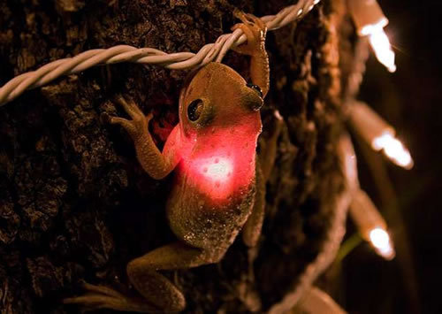

_[Neatorama](http://www.neatorama.com/2009/04/04/ribbit-frog-all-lit-up-by-swallowed-christmas-light/)_

_This is a Cuban tree frog on a tree in my backyard in southern Florida. How and why he ate this light is a mystery. It should be noted that at the time I was taking this photo, I thought this frog was dead having cooked himself from the inside. I’m happy to say I was wrong. After a few shots he adjusted his position. So after I was finished shooting him, I pulled the light out of his mouth and he was fine. Actually, I might be crazy but I don’t think he was very happy when I took his light away.  
_
