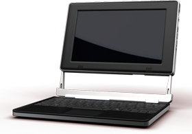

[Always Innovating](https://www.alwaysinnovating.com/home/)

- ARM Texas Instruments OMAP3 chip
- 1024x600 8.9’’ screen
- Storage: 8GB micro SD card
- Wifi 802.11b/g/n and Bluetooth
- 3-dimensional accelerometer
- Speakers, micro and headphone
- 6 USB 2.0 (3 internal, 2 external, 1 mini)
- 10+ hours of battery life
