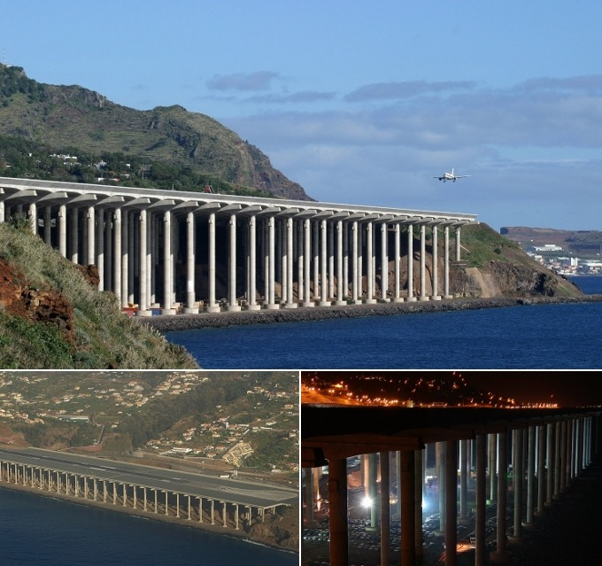

When engineers were looking for a viable way to extend Funchal Airport’s dangerously brief runway, they cleverly opted to ‘rest’ the enormous structure on 180 pillars, each measuring 230ft, rather than using landfill to support the strip. The result is a unique, safe runway which now also houses a car park underneath its extension. The newly adapted runway also won the IABSE’s Outstanding Structure Award in 2004.

[Premier Holidays : 4 Of The World’s Strangest Airport Runways](http://www.premier-holidays.com/info/4_of_the_worlds_strangest_airport_runways.aspx)
