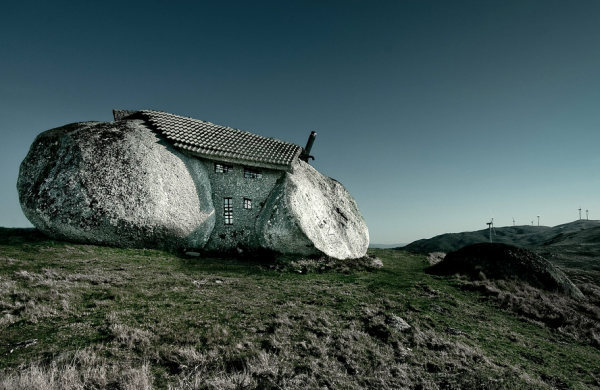

[A Casa do Penedo - os Flinstones à portuguesa](http://blog.uncovering.org/archives/2009/12/casa_rochedo.html?utm_source=feedburner&utm_medium=feed&utm_campaign=Feed%3A+OBVIOUS+%28o+b+v+i+o+u+s%29&utm_content=Google+Reader)

Em plena Serra de Fafe, entre a cidade do mesmo nome e Cabeceiras de Basto, situada na região norte de Portugal, encontra-se uma casa que anda a despertar a curiosidade dos internautas de todo o mundo pela sua originalidade. Construída entre quatro rochas gigantes, a **Casa do Penedo** é mais do que uma residência rural perdida no interior de um pequeno país na orla ocidental da Europa.
