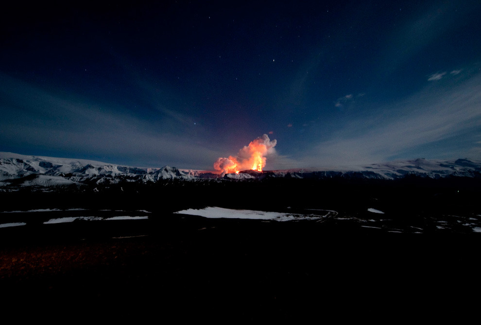

[The Big Picture - Boston.com](http://www.boston.com/bigpicture/2010/04/icelands_disruptive_volcano.html)

This picture taken on March 27, 2010 shows lava spurting out of the site of a volcanic eruption at the Eyjafjallajökull volcano some 125 km east of Reykjavik. With lava still gushing, a small Icelandic volcano that initially sent hundreds fleeing from their homes is turning into a boon for the island nation’s tourism industry, as visitors flock to catch a glimpse of the eruption.)
