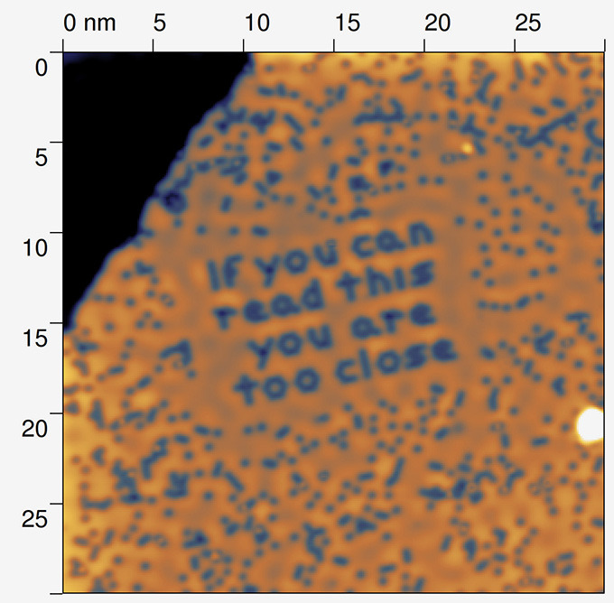

[20 Years of Moving Atoms, One by One | Gadget Lab | Wired.com](http://www.wired.com/gadgetlab/2009/09/gallery-atomic-science/6/)

These words were created by laying carbon monoxide molecules on a flat copper surface.
