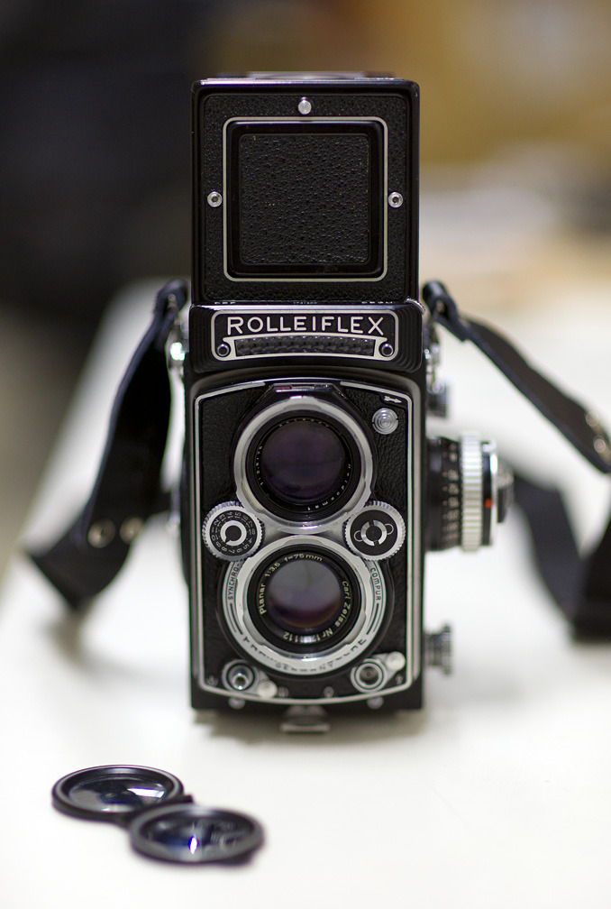

[dandellapiazza](http://dandellapiazza.tumblr.com/post/1270141046/back-to-the-future-rolleiflex-3-5e-planar)

Back to the future - Rolleiflex 3.5E Planar.  Interestingly, the first cameras I remember my parents using were a rangefinder and TLR and these have become my staples when it comes to film shooting.  I’m lucky to have found a Rollei in this kind of shape and look forward to putting it through it’s paces.
