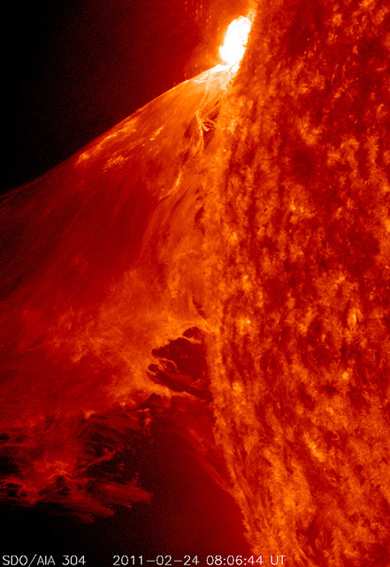

[NASA’s SDO Captures a Monster Prominence](http://www.flickr.com/photos/gsfc/5483196119/in/photostream/)

When a rather large-sized (M 3.6 class) flare occurred near the edge of the Sun, it blew out a gorgeous, waving mass of erupting plasma that swirled and twisted over a 90-minute period (Feb. 24, 2011). This event was captured in extreme ultraviolet light by NASA’s Solar Dynamics Observatory spacecraft . Some of the material blew out into space and other portions fell back to the surface. Because SDO images are super-HD, we can zoom in on the action and still see exquisite details. And using a cadence of a frame taken every 24 seconds, the sense of motion is, by all appearances, seamless. [Sit back and enjoy the jaw-dropping solar show.](http://www.flickr.com/photos/gsfc/5483193591/in/photostream "Video")
