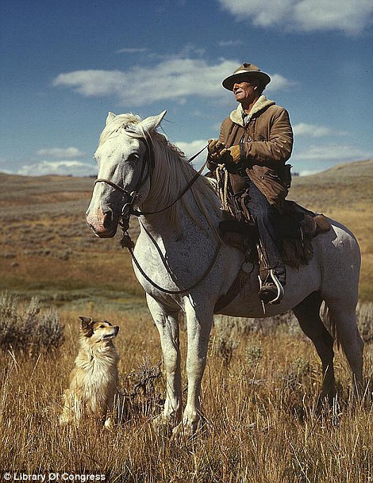

a shepherd with his horse and dog on Gravelly Range Madison County, Montana, August 1942 (via [DailyMail](http://www.dailymail.co.uk/news/article-1388179/Rare-Library-Congress-colour-photographs-Great-Depression.html))
