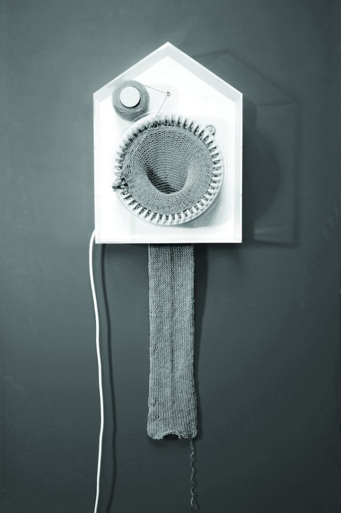

The 365 Knitting Clock by [Sirene Elise Wilhelmsen](http://www.sirenelisewilhelmsen.com/) is stitching the time as it passes by. It is knitting 24 hours a day and one year at the time, showing the physical representation of time as a creative and tangible force. After 365 days the clock has turned the passed year into a 2 m long scarf. Now the past can be carried out in the future and the upcoming year is hiding in a new spool of thread, still unknitted.
