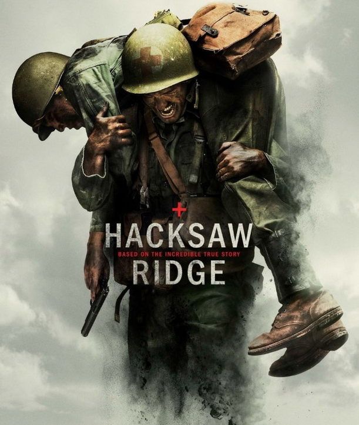

Vi recentemente o filme [o herói de Hacksaw Ridge](http://www.imdb.com/title/tt2119532/). É um bom filme. Dos que gostei mais nos últimos tempos. Gostei principalmente por ser baseado numa história verídica.

Capa do filme

​A frase que mais me marcou foi a que o herói dizia de cada vez que ia buscar feridos ao campo de batalha.

> _Just help me get one more Lord._

A guerra com os japoneses era — discutivelmente — justa porque defendia um estado e os seus valores contra agressores estrangeiros. O herói, Desmond, apenas queria salvar a vida dos seus semelhantes quer amigos quer inimigos ao mesmo tempo que participava na guerra que acreditava ser justa.

Se cada homem tem uma alma eterna, a sua vida tem mais valor do que qualquer estado ou instituição existente. Os estados e instituições vão todos passar eventualmente. A alma vai existir eternamente. Eu acredito nisto. Assim sendo, também quero entrar na guerra para salvar a alma dos homens do inferno. Quero tal como o Desmond, dizer a cada dia:

> Just help me get one more Lord.
