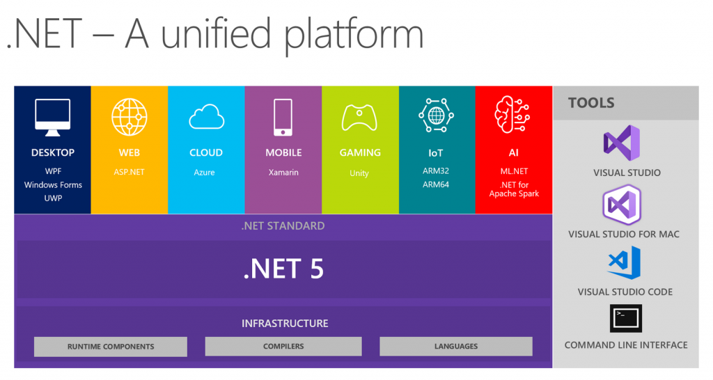
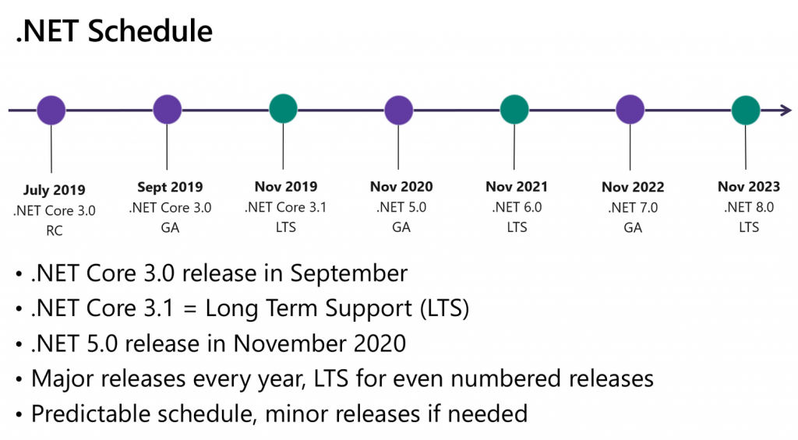

For the last 8 years I have worked with .NET as my main development platform. When someone asked what is .NET I had some difficulty with having a clear response. So to get my ideas in order I wrote this.

# Definition

<table><tbody><tr><td><a href="https://dotnet.microsoft.com/">.NET</a> (pronounced "dot net") is a free (as in beer), cross-platform (Windows, Linux, and macOS) and <a href="https://github.com/dotnet">open-source</a> framework for developing a variety of application models such as <a href="https://dotnet.microsoft.com/apps/aspnet">Web</a>, <a href="https://dotnet.microsoft.com/apps/desktop">Desktop </a>or <a href="https://dotnet.microsoft.com/apps/xamarin">Mobile </a>Apps, <a href="https://dotnet.microsoft.com/apps/gaming">Games</a>, <a href="https://dotnet.microsoft.com/apps/aspnet/microservices">Microservices,</a> <a href="https://dotnet.microsoft.com/apps/machinelearning-ai">Machine Learning</a> and <a href="https://dotnet.microsoft.com/apps/iot">IOT</a>.NET is open source and under the <a href="https://www.dotnetfoundation.org/">.NET Foundation</a>. The .NET Foundation is an independent organization to foster open development and collaboration around the .NET ecosystem.</td></tr></tbody></table>

## [What is .NET?](https://www.youtube.com/watch?list=PLdo4fOcmZ0oWoazjhXQzBKMrFuArxpW80&v=eIHKZfgddLM)

We can view the .NET framework from 3 different sides

### The Platform

The platform is where your code runs, the runtime and the development tooling that comes with it like compilers  
There are 4 main runtime implementations for .net:

1. The old .NET Framework, that stopped new development, but will be supported as a component of the Windows OS ([source](https://docs.microsoft.com/en-us/lifecycle/faq/dotnet-framework))
2. [Mono](https://www.mono-project.com/), which is an open-source implementation of the .NET Framework
3. [.NET Core](https://github.com/dotnet/runtime), which is the new open-source version of the .NET framework from Microsoft
4. [.NET Native](https://docs.microsoft.com/en-us/dotnet/framework/net-native/) for [Universal Windows Platform](https://docs.microsoft.com/en-us/windows/uwp/get-started/universal-application-platform-guide)

The last version of the .NET Framework will be 4.8 and of .NET Core will be 3.1. After this there will be only .NET, [starting with version 5.](https://devblogs.microsoft.com/dotnet/introducing-net-5/)

Programs written for .NET execute in a software environment (in contrast to a hardware environment) named the [Common Language Runtime](https://docs.microsoft.com/en-us/dotnet/standard/clr) (CLR)  
The CLR is an application virtual machine that provides services such as security (type safety, memory access,...), memory management (allocation, garbage collection, ...), and exception handling.

The CLR runs software that is compiled to [Intermediate Language](https://en.wikipedia.org/wiki/Common_Intermediate_Language) (IL). Any language that compiles to IL, can be run in a .NET runtime.

The .NET compilers produce assemblies (files with the .dll extension) that contain executable code in the form of IL instructions, and symbolic information in the form of metadata.  
Before it is executed, the IL code in an assembly is converted to processor-specific code by the CLR

### The Libraries

All .NET implementations implement base set of APIs, which are called the [.NET standard](https://dotnet.microsoft.com/platform/dotnet-standard)

If you write code that targets a .NET standard, it will be able to run in any runtime that supports it

Each implementation can also expose additional APIs that are specific to the operating systems it runs on.  
For example, .NET Framework is a Windows-only .NET implementation that includes APIs for accessing the Windows Registry.

In addition to the .NET standard, we have [NuGet](https://www.nuget.org/), the default package manager and repository for .NET libraries, where we can find over 200 000 packages

### The Languages

.NET supports multiple programming languages. The .NET implementations implement the [Common Language Infrastructure (CLI)](https://visualstudio.microsoft.com/license-terms/ecma-c-common-language-infrastructure-standards/), which among other things specifies a language-independent runtime and language interoperability.  
This means that you choose any .NET language to build apps and services on .NET. The CLI is an ECMA standard ([ECMA-335](https://www.ecma-international.org/publications/standards/Ecma-335.htm)), a very interesting 500 page read.

You can write .NET apps in [many languages](https://en.wikipedia.org/wiki/List_of_CLI_languages), but the most used ones are C#, F#, and Visual Basic.

- C# is object-oriented and type-safe programming language. Its now a standard in both [ECMA](https://www.ecma-international.org/publications/standards/Ecma-334.htm) and [ISO](https://standards.iso.org/ittf/PubliclyAvailableStandards/) (ECMA-334, ISO/IEC 23270)
- F# is an open-source, functional programming language for .NET. It also includes object-oriented and imperative programming.
- Visual Basic is object-oriented and type-safe but has an [approachable syntax](https://www.red-gate.com/simple-talk/dotnet/net-framework/10-reasons-why-visual-basic-is-better-than-c/) that uses more words than symbols

## .NET Releases and Support ([source](https://dotnet.microsoft.com/platform/support/policy))

.NET Core 3.0 shipped in September 2019, and .NET 5 is planned for November 2020. After that a major version of .NET is expected once a year, every November

There are 2 types of releases. Long Term Support (LTS) and Current. The even numbered ones will be LTS.

LTS releases are supported for three years after the initial release. Current releases are supported for three months after a subsequent Current or LTS release.  
LTS releases will receive only critical and compatible fixes throughout their life-cycle. Current releases will receive these same fixes and will also be updated with compatible innovations and features.

