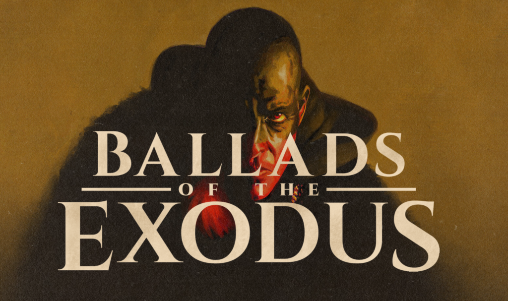

[https://www.balladsoftheexodus.com/](https://www.balladsoftheexodus.com/)

Não é o filme típico. Em 1º lugar tem 2 partes, são mais de 4 horas de filme com um interlúdio no meio, em 2º lugar praticamente não tem diálogo - é quase um musical? - e por fim não tenta reproduzir fielmente a época da história original, com grandes anacronismos introduzidos propositadamente.

Não é nada do que estava à espera mas no entanto gostei. É incrível como ler nos pode dar muito detalhe e precisão, mas nada bate a 7ª arte para capturar a imaginação e fazer-nos entrar na história.


