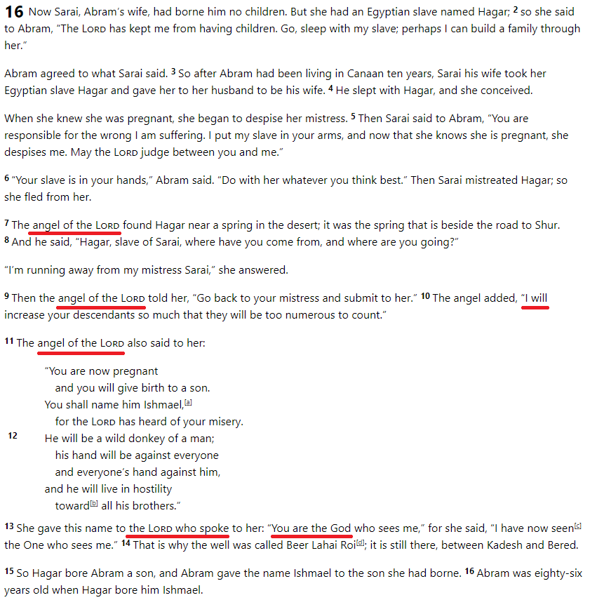
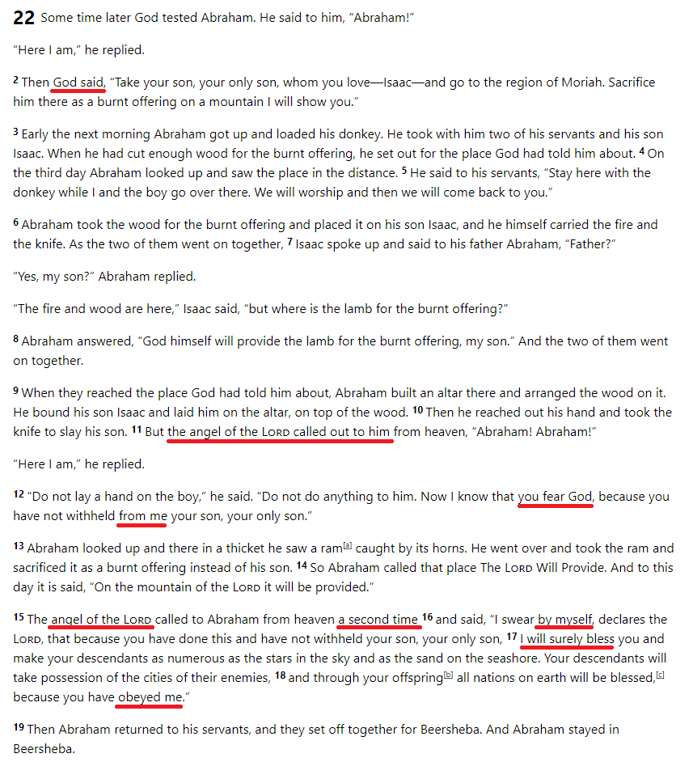
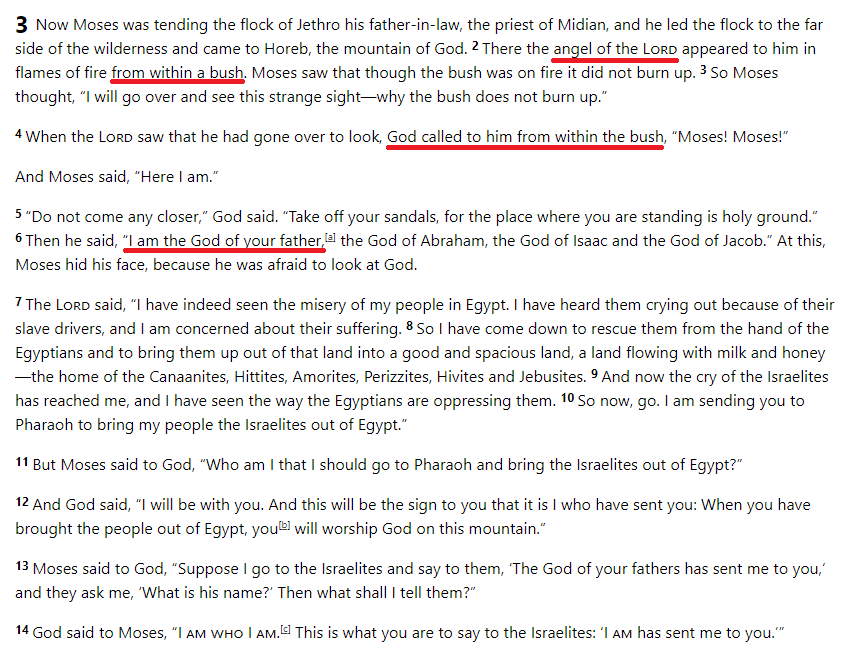
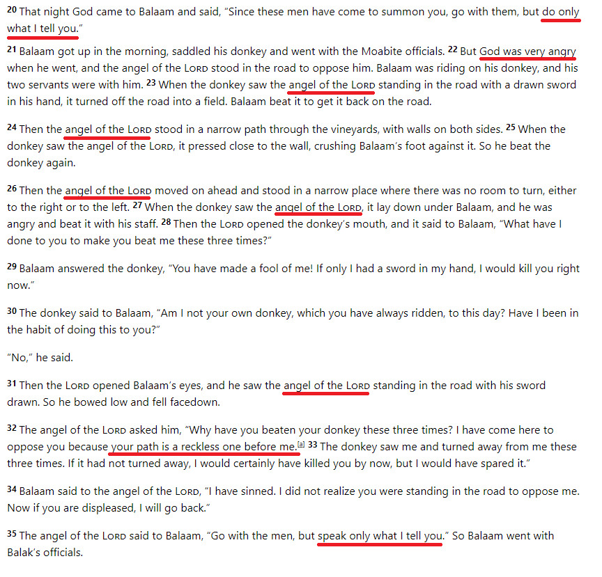

I had a recent conversation with some Muslim friends, where they raised my attention to the story of Jacob in Genesis, [where he fights with a man](https://www.biblegateway.com/passage/?search=Gen+32%3A24-32&version=NIV). They were showing me a Christian commentary on this text where this man is said to be God himself, and possibly even Jesus. As Muslims, they see as unfit and even impossible for God to enter into creation as a man, and much less so wrestling with someone. As a defense for the Christian commentary I can only think of two lines of evidence from the text itself.

- Firstly, the man says to Jacob _"you have struggled with God"_.
- Secondly, Jacob, after asking the man for his name, says that he _"seen God face to face"_.

Both these statements are reasons to make us wonder. What did the man mean when he said that Jacob struggled with God? What did Jacob mean when he said he saw God face to face? Were this metaphors? My Muslim friends are right in questioning this interpretation. It surely is strange that an all powerful entity fights with a mere mortal man. I agreed with them in that this story does not state clearly that this person is another thing than just a man or perhaps an angel.

But can we find any other instances on the bible where someone is portrayed as God himself entering into creation? Are there clearer texts where we can establish some grounding for the claim that this fight was not with a mere man? I claim that there are.

* * *

I will now try to show from the first five books of the bible, the [Torah](https://en.wikipedia.org/wiki/Torah), that many times God has entered into creation. I will do this from the Torah because the [Quran also recognizes it](https://quran.com/5:44) as an inspired scripture from God, written by Moses. I will do this by looking for the passages that where this person is referred as _the Angel of the Lord_. For this project, I will search the Torah for the expression "**מלאך יהוה**" which is translated as the Angel of the Lord.

- The word [מלאך](https://en.wikipedia.org/wiki/Angels_in_Judaism), transliterated as _malak_ means messenger or ambassador. It is translated as αγγελος, transliterated as _angelos_ in the [Septuaging](https://en.wikipedia.org/wiki/Septuagint), which has the same meaning.
- The word יהוה transliterated as _yehovah_ is [the name of God](https://en.wikipedia.org/wiki/Tetragrammaton) for the Jews. God is what he is but יהוה is who he is. It is translated as _κύριος_ the Septuaging, which means Lord, as in the one who has supreme authority.

There are only four passages on the Torah where the expression "מלאך יהוה" is used. In each one of them, I find reasons to identify this messenger with God himself.

Even if you don't consider the Torah as a sacred text, or maybe not even a historical account of real events but only as a human production, the writer did leave some (not so) subtle evidence that this person was not simply an angel or messenger but rather a divine figure whom the text identifies with the God of the Jews.

## Hagar

The [first occurrence](https://www.biblegateway.com/passage/?search=Genesis%2016&version=NIV) is in Genesis 16. This is the story of the first son of Abraham, Ishmael, born through the Egyptian slave of his wife Sarah Hagar. For reasons that are not important here, Hagar and her son encounter the Angel of the Lord. Some things that the angel says and how Hagar speaks about him after the encounter are noteworthy.

- First, the angel says that it is _he will_ increase her descendants. Not that God will increase, but rather the Angel of the Lord will do it.
- Secondly, the writer clearly says that it was יהוה, _yehovah_, who spoke to Hagar, and that she named this entity as "_the God who sees me_"

## Abraham

The [second occurrence](https://www.biblegateway.com/passage/?search=Genesis+22&version=NIV) is in Genesis 22, the famous story when God asks Abraham to sacrifice his son. Right before Abraham slays his son the Angel of the Lord intervenes and stops the sacrifice. Some notes:

- First, even though it was God who asked for the sacrifice, the Angel of the Lord said that Abraham didn't withhold his son _from him_. Doing so was an evidence that Abraham feared God.
- Secondly, the Angel of the Lord swore _by himself_ that he would bless Abraham and his descendants due to his obedience.

## Moses

The [third occurrence](https://www.biblegateway.com/passage/?search=Exodus+3&version=NIV) is in the book of Exodus. In the third chapter, Moses is called to be the savior of he Hebrews, who were slaves in Egypt.

- The only thing to note here is that verse 2 says that it was the Angel of the Lord who was on the bush, but in verse 4 it was God himself.
- This is a very interesting passage because here God says that his name is "I AM", who is related to the proper name of God יהוה, _yehovah_. An interesting topic for another time.

## Balaam

The [last occurrence](https://www.biblegateway.com/passage/?search=Numbers+22&version=NIV) is a very strange one indeed. It is on the 22nd chapter of the book of Numbers, where God is angry at a man called Balaam. There are many details on this story that give rise to all sorts of questions, but even here we can see that the Angel of the Lord identifies himself with God.

- Firstly, in the beginning God tells Balaam to only _do what I tell you_, but in the end the Angel of the Lord tells him to only _speak what I tell you_.
- Secondly, opposition comes to Balaam because his path is a reckless one _before the Angel of the Lord_, not _before God_.

* * *

It is my opinion that these 4 texts clearly show that in the Torah this entity called the Angel of the Lord is actually **God himself**, entering into creation and interacting with it. There are other texts outside of the Torah that say more about this entity, and some other passages in the bible where we see God interacting with his creation, but from these four we can establish a good starting point. This incredible notion, that God can walk among us, is actually possible in a biblical worldview. I may need to go deeper here…
