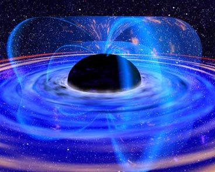

[SIC Online](http://sic.aeiou.pt/online/noticias/vida/Buraco+negro+gigante+no+centro+da+nossa+galaxia.htm)

Ao fim de 16 anos de pesquisa foi finalmente encontrado o que se suspeitava: no centro da Via Láctea existe um buraco negro gigante que gera uma força gravitacional suficiente para manter a unidade da nossa galáxia.
