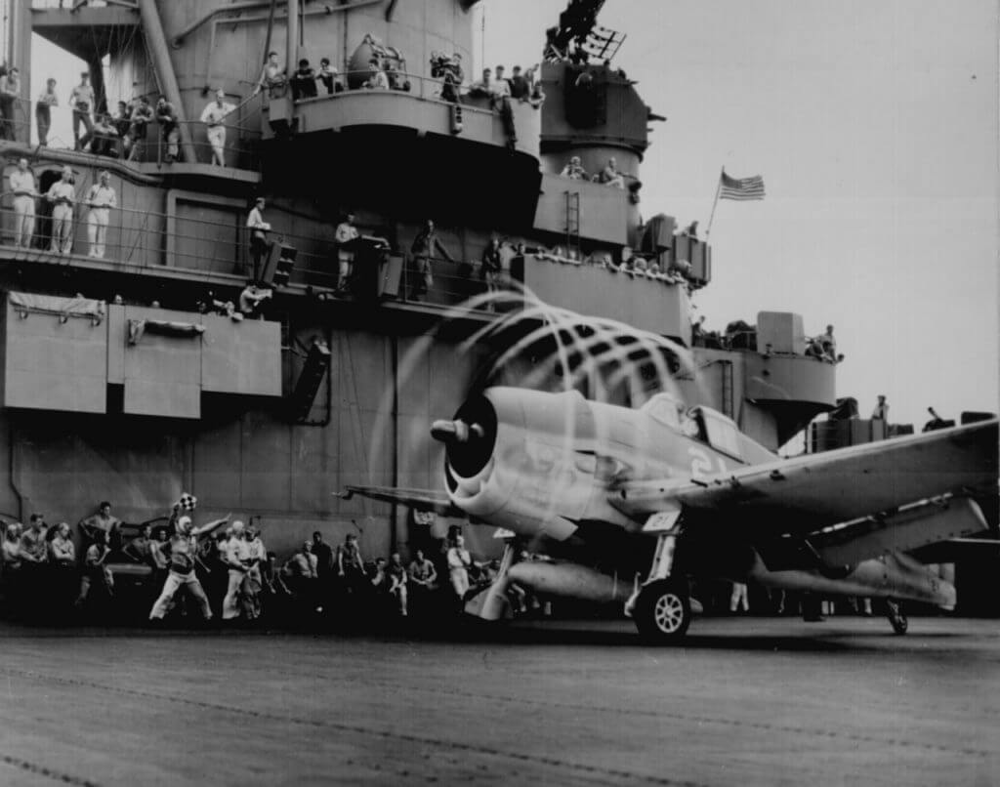

Dynamic static. The motion of its props causes an \`aura’ to form around this F6F on USS YORKTOWN. Rotating with blades, halo moves aft, giving depth and perspective.“ November 1943 (via [World War II Photos](http://www.archives.gov/research/ww2/photos/#aviation))
