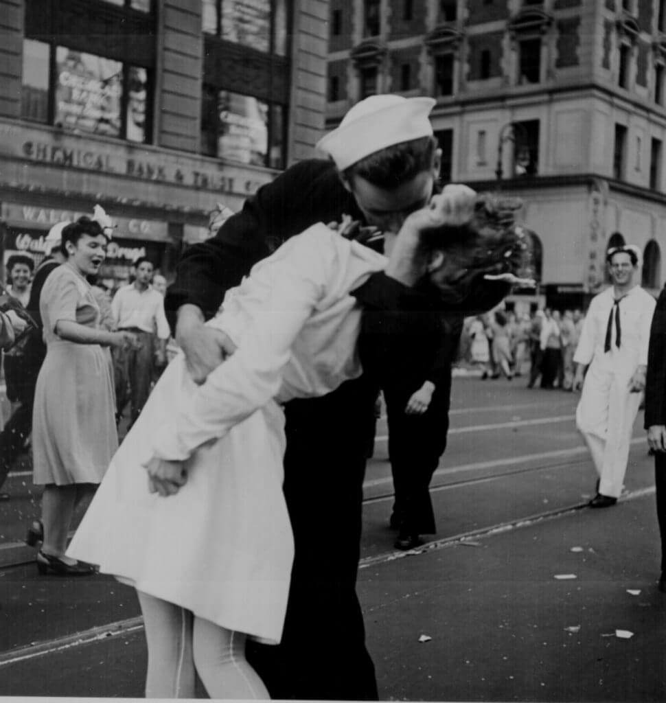

“New York City celebrating the surrender of Japan. They threw anything and kissed anybody in Times Square.” Lt. Victor Jorgensen, August 14, 1945 (via [World War II Photos](http://www.archives.gov/research/ww2/photos/#aviation))
