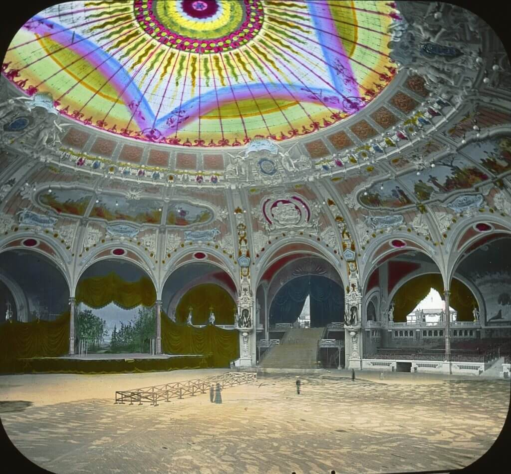
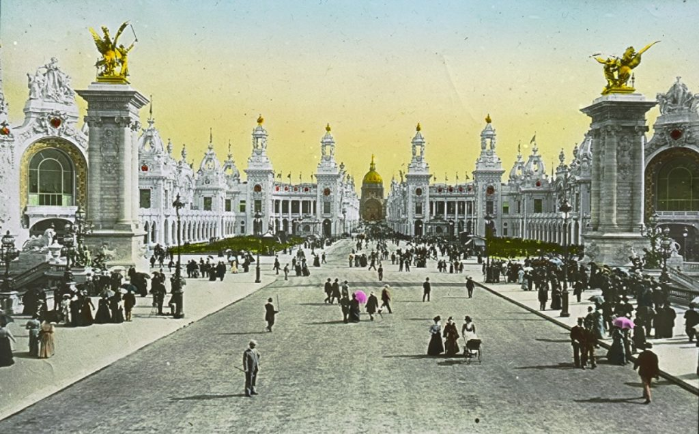
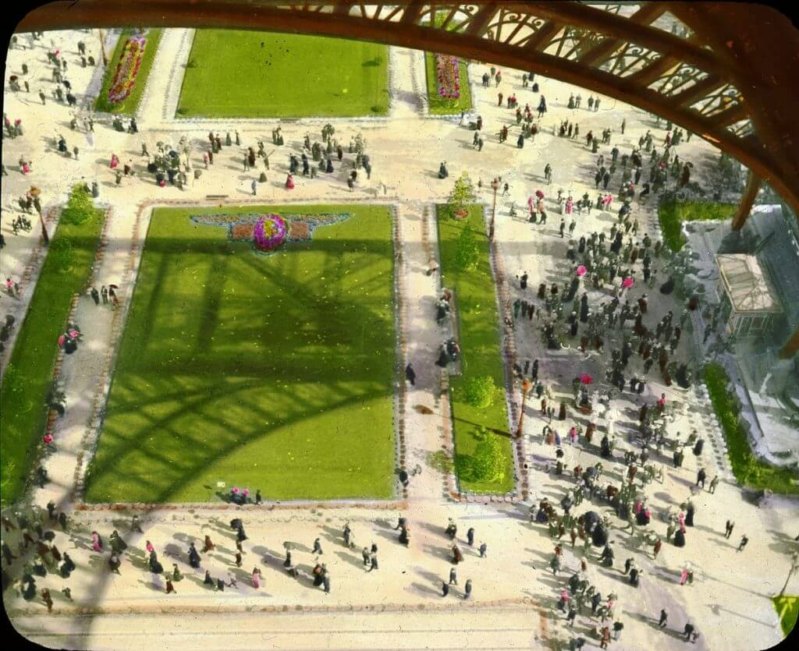
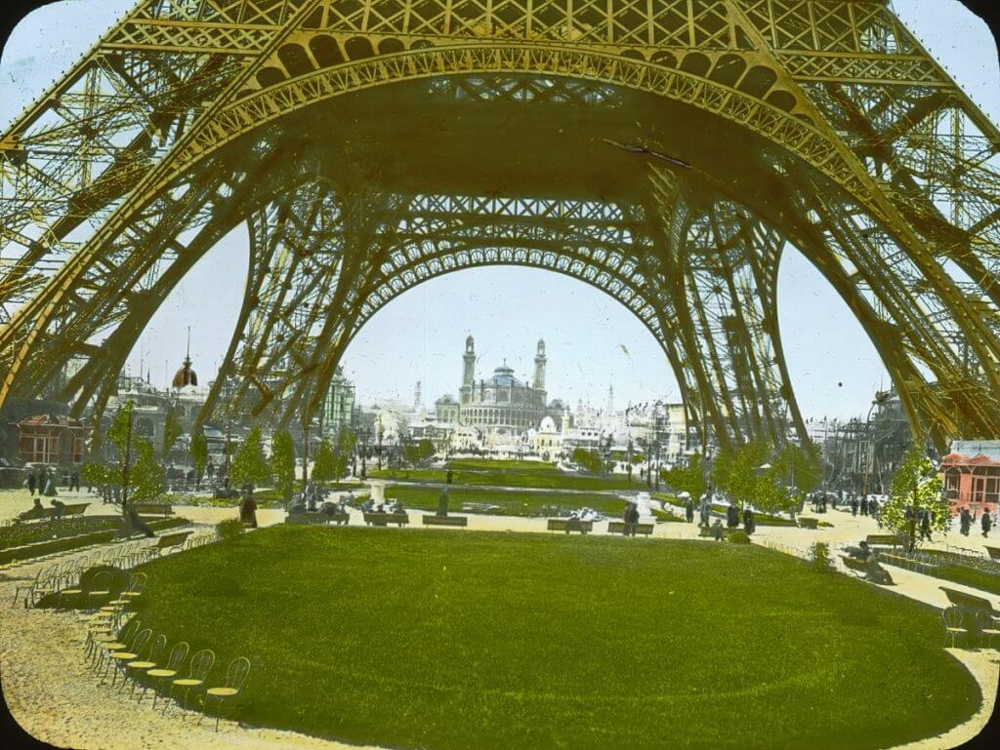

- 
    
    Salle des Fetes
    
- 
    
    Pont Alexandre III
    
- 
    
    gardens
    
- 
    
    Eiffel Tower and Trocadero
    

[Paris Exposition of 1900](http://www.flickr.com/photos/brooklyn_museum/sets/72157604656089762/)
