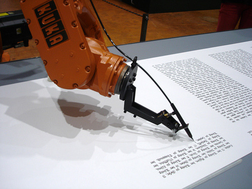

The Kuka robot is silently writing a version of the martin luther bible, which was originally printed in a early font called “Schwabacher”, retranslated here by RobotLab into calligraphy. “Wolfgang von Kempelen, Mensch-\[in der\]-Maschine” exhibition, ZKM, Karlsruhe (D).
More infos : [www.robotlab.de/](http://www.robotlab.de/)
