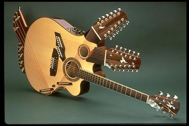

Four necks. Two sound holes. 42 strings. Two access doors; one on the upper player’s side and one at the tail block. Created by luthier Linda Manzer for guitarist Pat Metheny, the instrument took 2 years to build (approximately 1000 hours), and when the 42 strings are strung up to high tension, the Pikasso is under approximately 1000 lbs pressure. It weighs 6.7 kg or 14 ¾ lbs.

[Pikasso, multi-necked guitar by luthier Linda Manzer](http://www.oddmusic.com/gallery/om23350.html)
