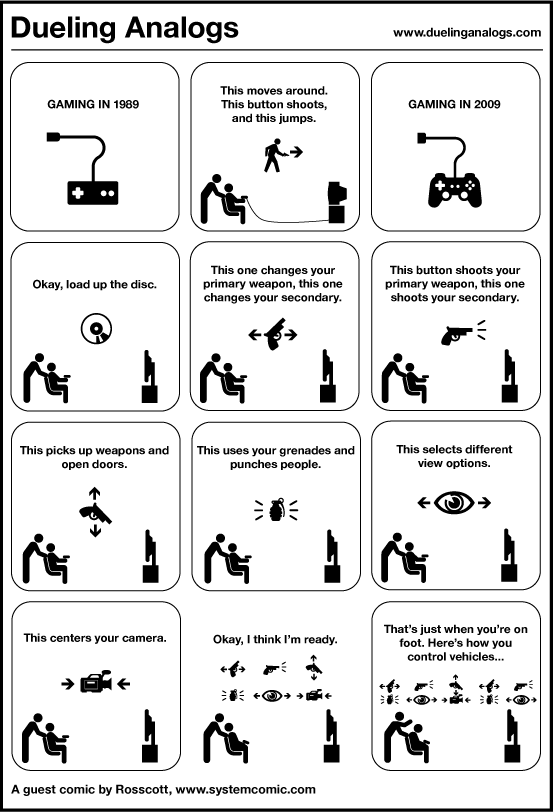

[lardissone](http://www.leandroardissone.info/post/276404278/video-juegos-1989-vs-2009-lo-peor-es-que-es):

> Lo peor es que es verdad. Hace 20 años, con poder coordinar cuando saltar y disparar a la vez estabas listo para jugar y bien.  
> Ahora, por favor, los juegos son terriblemente confusos, hasta que terminas de entender los controles el juego ya se tornó aburrido.
> 
> Y lo peor es cuando ya avanzaste a duras penas un 50% y te das cuenta que si apretas L1 y L2 a la vez tira una super bomba de protones que revienta a 25 enemigos de un saque y no te gasta nada. Ahh.. ahi ya la vida no tiene sentido.
> 
> Poneme un Tetris!
> 
> via: [GamOvr - Pix for game geeks](http://gamovr.mx981.com/post/2035?utm_source=feedburner&utm_medium=feed&utm_campaign=Feed%3A+Gamovr+%28GamOvr%29)
