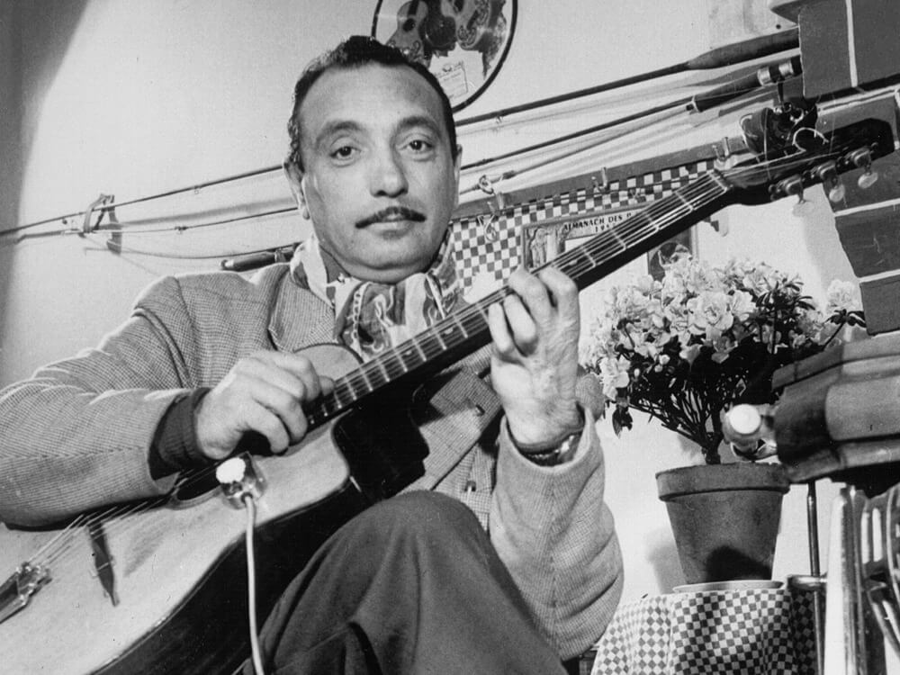

Django Reinhardt would play any chance he got. At the height of his fame, he’d stroll into a bistro with his guitar and busk — not for the spare change, but just to play.

[Django Reinhardt: 100 Years Of Hot Jazz : NPR](http://www.npr.org/templates/story/story.php?storyId=122865782&sc=fb&cc=fp)
