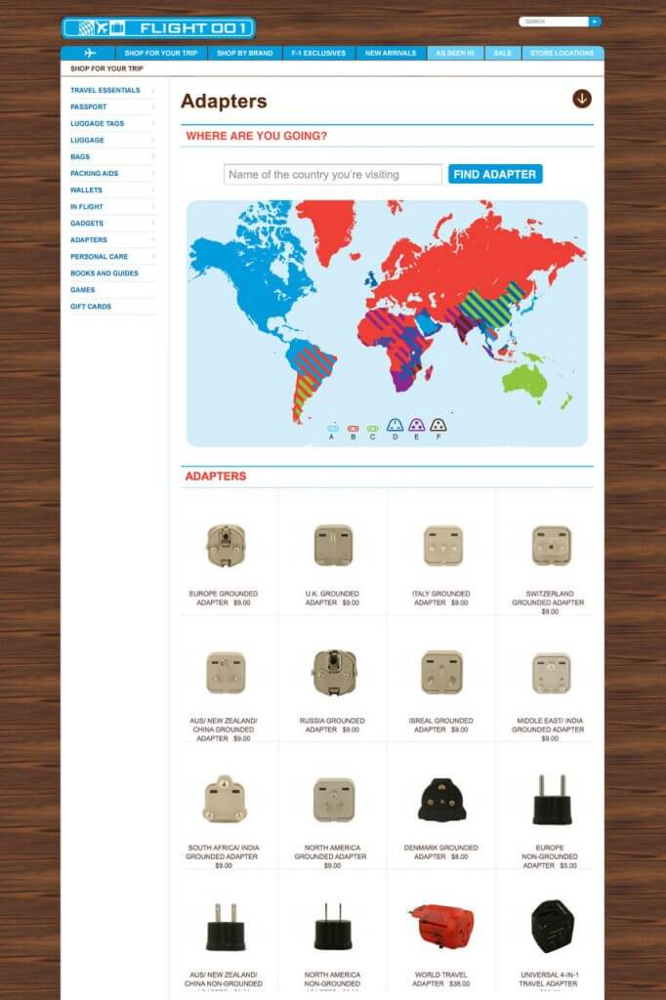

[jamesnord](http://www.jamesnord.com/post/358062019/lets-be-honest-figuring-out-what-adapter-to-use):

> Let’s be honest. Figuring out what adapter to use when you are traveling is a bitch. Do I need Adapter B Plug 6? Or is it Adapter E Plug 11? Well [Josh](http://mynameisjosh.com) and I worked together and launched a new feature at FLIGHT 001 where you can just type in the country you are traveling to and we will pull the adapter you need. Your life, simplified.
> 
> [Check it out.](http://www.flight001.com/shop-for-your-trip/gadgets/adapters.html)
