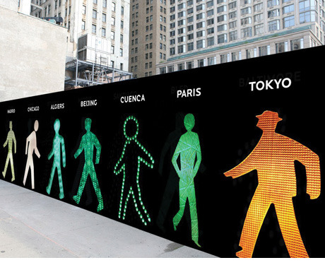

[devincastro](http://devincastro.tumblr.com/post/471510255):

> _Walking Men 99™_ is a site-specific public art installation by [Maya Barkai](http://www.mayabarkai.com/). Surrounding the site of the new Four Seasons Hotel in NYC’s Downtown area is a photographic collage of 99 pedestrian traffic-light icons collected from around the world.
