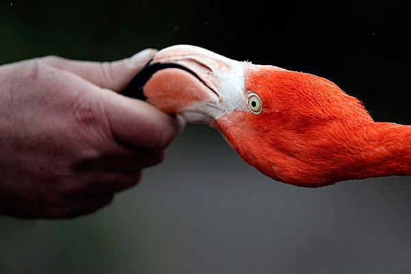

[inothernews](http://inothernews.tumblr.com/post/483469524/beakeasy-a-zookeeper-holds-the-beak-of-a)

> _**BEAKEASY**   A zookeeper holds the beak of a Caribbean flamingo at Chester Zoo in northern England on March 29. The zoo’s 87 flamingos are being measured, weighed, and microchipped for the first time in a decade as part of a check-up.  (Photo: Phil Noble / Reuters via the Christian Science Monitor)_
