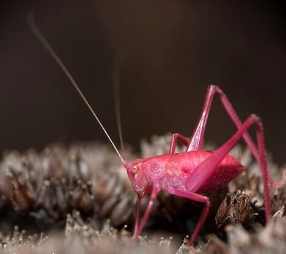

What you are looking at is the very rare and very pink katydid. First discovered back in 1887, the pink katydid is so rare that they occur once out of every 500 individuals. You have a better chance of spotting a unicorn in the wild.

Of course, the color pink alone isn’t very common to the animal kingdom, flamingos aside. It’s the result of a condition called erythrism, similar to the recessive gene that afflicts albino animals. (via [Photos of the Very Rare Pink Katydid : TreeHugger](http://www.treehugger.com/files/2010/05/pretty_in_pink_one_very_rare_katydid.php))
