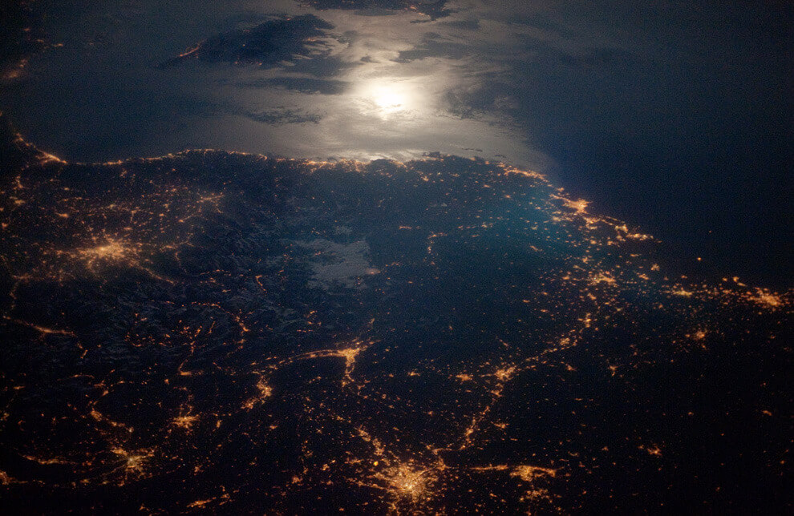

[Around the Solar System - The Big Picture - Boston.com](http://www.boston.com/bigpicture/2010/09/around_the_solar_system.html)

Brightly lit metropolitan areas of Torino (Italy), Lyon, and Marseille (both in France) stand out amidst numerous smaller urban areas in this dramatic photograph taken by a member of the ISS Expedition 23 crew on April 28, 2010
