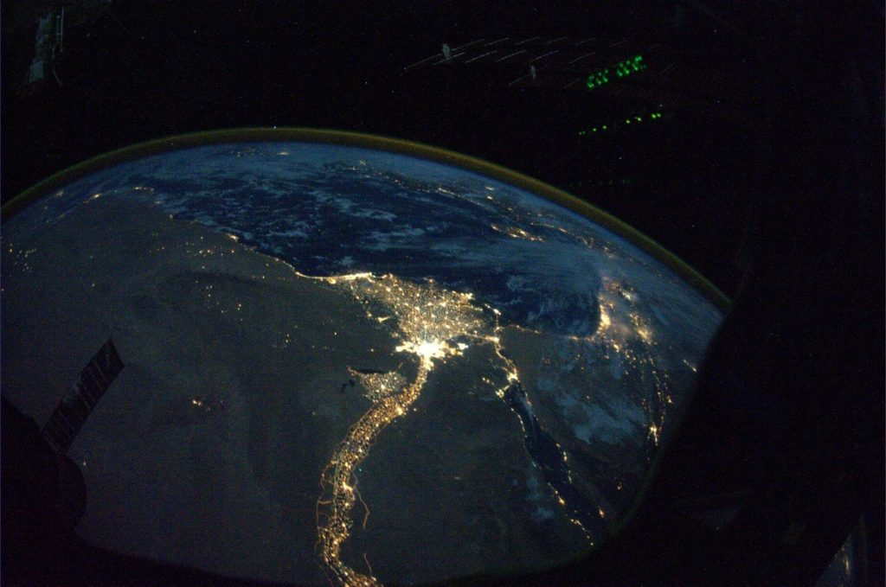

[jthqp](https://jthqp.tumblr.com/post/1449966537)

> [@Astro\_Wheels](http://twitter.com/#!/Astro_Wheels/status/29230783819): A night view of the Nile River winding up through the Egyptian desert toward the Mediterranean Sea, and Cairo in the river delta. Such a stark contrast between the dark desolate lifeless desert of northern Africa and the Nile River teeming with life along its shores. In the distance… the eastern Mediterranean on a beautiful autumn evening.
