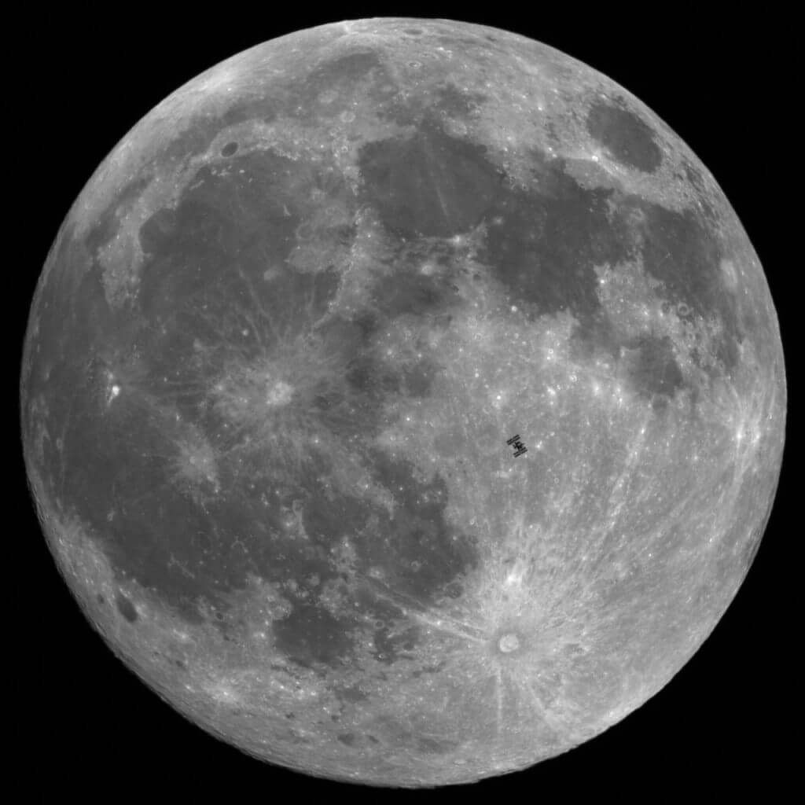

[unknownskywalker](http://unknownskywalker.tumblr.com/post/2514000028)

> From our vantage point on Earth, it takes just a half second for the International Space Station to fly across the face of the Moon, so catching a transit is tricky. But award-winning French astrophotographer **[Theirry Legault](http://astrosurf.com/legault/)** captured an amazingly sharp and detailed transit image that makes the ISS look like it is sitting on the Moon’s surface!
> 
> Legault took this image from Avranches (Normandy, France) a few hours before the eclipse, on December 20th at 21:34 UT. He used a Meade 10″ ACF on Takahashi EM400, with a Canon 5D mark II. The transit duration was just 0.55 seconds, as the ISS is traveling at 7.5km/s or 28,0000 km/h (17,500 mph).
> 
> **• Source:** [Universe Today](http://www.universetoday.com/82013/international-space-station-on-the-moon/) **•** [View High-Res (2919×2919 px)](http://www.astrosurf.com/legault/transit_iss_moon_101220_70.jpg)
