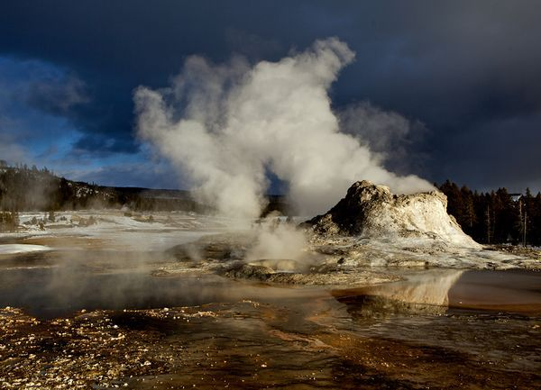

Yellowstone National Park’s supervolcano just took a deep “breath,” causing miles of ground to rise dramatically, scientists report. (via [Yellowstone Has Bulged as Magma Pocket Swells](http://news.nationalgeographic.com/news/2011/01/110119-yellowstone-park-supervolcano-eruption-magma-science/))
