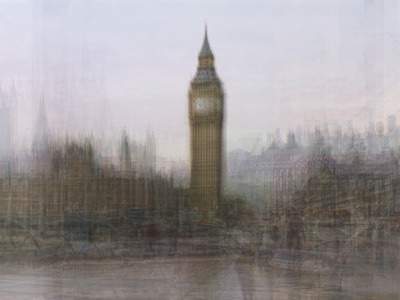

via [Photo Opportunities : Corinne Vionnet](http://www.corinnevionnet.com/index.php?/photo-opportunities/)

Series of photographic works entitled “Photo Opportunities”, from hundreds of snapshots of tourist locations culled from the Internet. By collecting and then bringing together successive layers of around a hundred similar “photo souvenirs”, these images conjure up questions about representation and memory of places.
