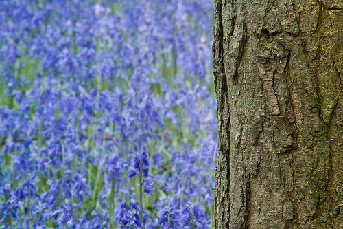

Every spring, bluebells flower in the undergrowth of north-west Europe’s old forests. This year, the late Easter gave plenty of opportunies to go out and capture them. (via [Bluebells « Flickr Blog](http://blog.flickr.net/en/2011/04/25/bluebells/))
