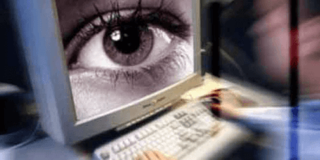

[Click here to stop the newest threat to Internet freedom](http://www.avaaz.org/en/eu_save_the_internet_spread/?hBDCHcb)

 **A new global treaty could allow corporations to police what we do on the Internet.** Last week we successfully pushed back the US censorship bills – **if we act now, we can get the EU Parliament to bury this new threat** – add your voice now!
