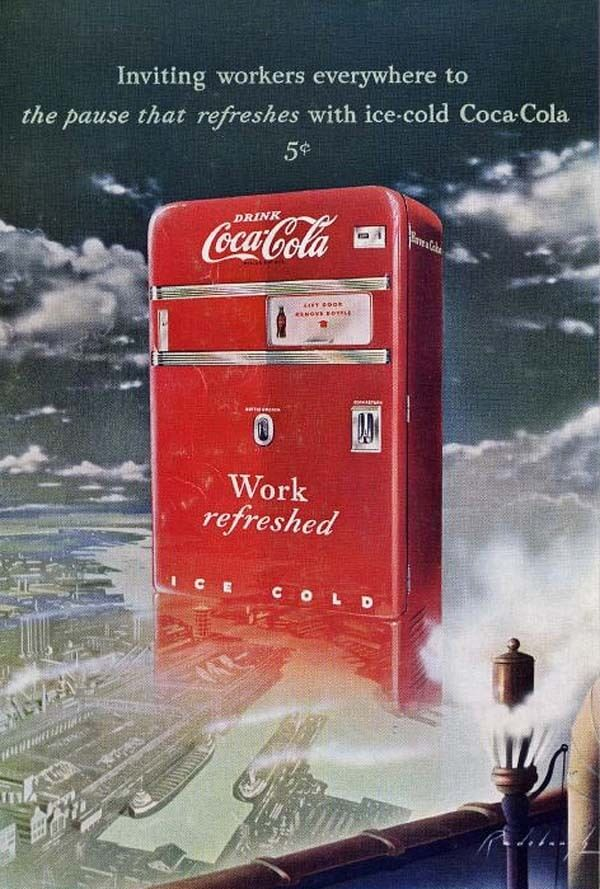

via [Obvious mag](http://obviousmag.org/sphere/2012/02/a-historia-da-coca-cola-em-publicidade.html)

After seeing this I’m now sure that inflation is not inevitable and its only a way that governments used to mask their debt.

From 1889 to 1949, Coca-Cola was 5c.
