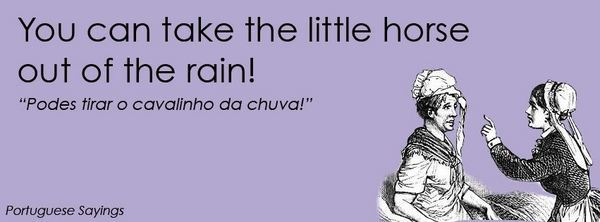

É de conhecimento geral que qualquer frase dita em inglês soa sempre melhor. No seguinte caso…talvez não! Imagine que os nossos tradicionais ditados populares são traduzidos à letra para inglês? Foi precisamente essa brincadeira que Luís Santos fez. Criou uma página no facebook – que rapidamente se tornou um fenómeno de likes e shares – onde através de pósteres ilustrados transformou os “dizeres portugueses” numa divertida bizarrice inglesa (via [portuguese sayings – a tradição portuguesa](http://obviousmag.org/sphere/2012/10/portuguese-sayings-a-tradicao-portuguesa.html))
