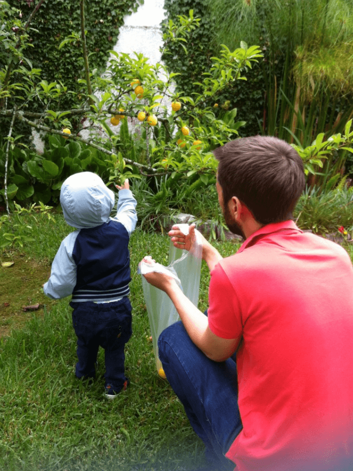

[This post](https://hackernoon.com/im-harvesting-credit-card-numbers-and-passwords-from-your-site-here-s-how-9a8cb347c5b5) shows that it doesn’t take a really smart exploit like [spectre or meltdown](https://spectreattack.com) for malicious purposes.

The main takeaway from this is PLEASE USE [CSP](https://developer.mozilla.org/en-US/docs/Web/HTTP/CSP)!!

The cabin in the woods is sounding more appealing…

