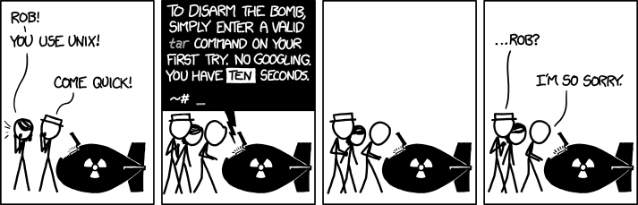

I’ve been a user of source tree but it has let me down many times (crashes, high memory usage).

I’ve recognized that i really don’t know that much about git. I should learn at least the commands I use the most.

I’m a windows user so [posh-git](https://github.com/dahlbyk/posh-git) is a must have. There are [great docs](https://git-scm.com/docs) for git but they can be a bit overwhelming and have a lot of detail that is not needed 90% of the time. So, here it is, my 7 item git jump-start list:

1. [git checkout](https://git-scm.com/docs/git-checkout) <branch>

The most basic command for switching branches. You can use -f to throw away any local changes

2\. [git fetch](https://git-scm.com/docs/git-fetch)

Used to update the remote status. Useful to know if i need to pull. Use -p to remove any remote-tracking references that no longer exist on the remote

3\. [git pull](https://git-scm.com/docs/git-pull)

Pulls latest commits from origin. Use -r to rebase changes that are not yet pushed

4\. [git add](https://git-scm.com/docs/git-add)

Adds changes to the staging area. Use -a to add all changes.

5\. [git commit](https://git-scm.com/docs/git-commit) -m “<message>”

Commits currently staged changes. Use -a to stage all changes before committing.

6\. [git push](https://git-scm.com/docs/git-push)

Push currently committed changed to origin.

7\. other stuff

I’m already cheating about the 7 items but now I’m getting into less used commands. [git stash](https://git-scm.com/docs/git-stash), [git merge](https://git-scm.com/docs/git-merge), git commit with amend, git push with force are all great tools to know about.

I cannot get my head around [git diff](https://git-scm.com/docs/git-diff). I still use GUI tools to handle conflicts and to review changes before committing.

That’s it. This list should be enough to keep me from using a GUI to interact with git most of the time.
