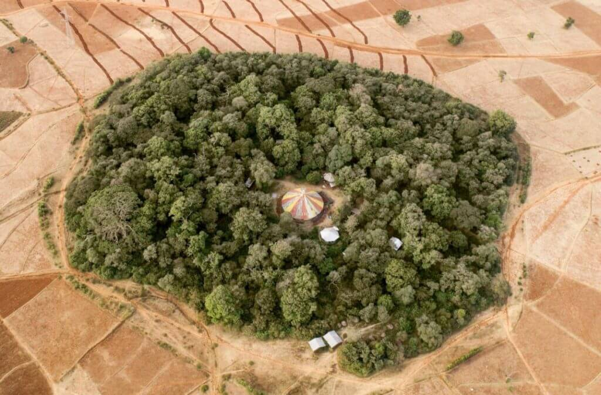

(via [Church forests in Ethiopia: An ancient example of creation care – The Pollinator: Creation Care Network News](http://news.lwccn.com/index.php/2019/12/31/church-forests-in-ethiopia-an-ancient-example-of-creation-care/))
