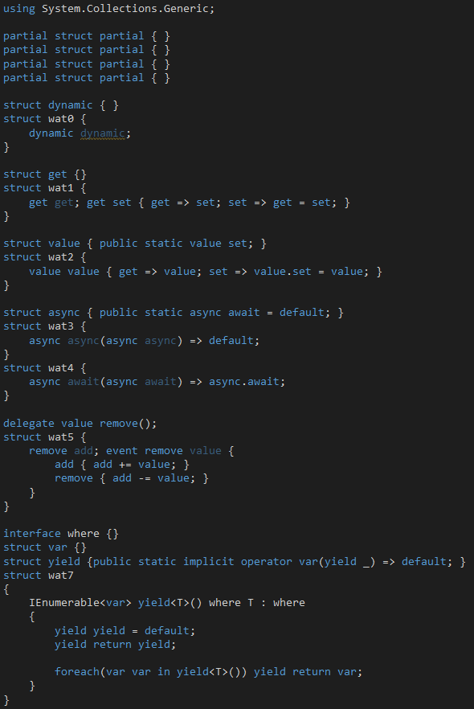

Inspired by [this tweet](https://twitter.com/jaredpar/status/1245419431607455745) I made some strange things in c#. Learn about [Contextual Keywords](https://docs.microsoft.com/en-us/dotnet/csharp/language-reference/keywords/contextual-keywords)!

See in [ShapLab](https://sharplab.io/#v2:EYLgxg9gTgpgtADwGwBYA0AXEBLANmgExAGoAfAAQAYACcgRhQG4BYAKDYAcBDKDbL3NQDOGKAFcwGat179BAb2oBfTjz4DhoiVJnqFy1bI0jxk6WrnVFK1rssnt5o/ptsHZggE8AdlwC22GBWBqzuUgDuXBg08mzU8dRevgFBSf6BLKyuoVpmAOYwUvI2YdSRGHRWcQkFUrWM1LXChcFNALwAfM0YDUItnY393Q022aUAbgJiMMHkAMy0dEjUk7jTwyGl5QBMVawJK1Mzq+uK7V0nML39F0cAdH1SbYdrVyFjuVLkAByzC/TLH60ACc1GeBBgADMuGJcD1Np8ylEFrF9gkgT8ABQY74ASjBXQh0NhPTYJUR5RQwXi1XiGOB2N+5GB+IGPzuzMy2QhuBgeSixyO1Fgfgg4xgmNxmS2UQArHsDiKxTMuAQCA0YOLvFIleKXqdaQdqKqCMETdRiM9LiNDYqYKK9YpzXArUcbWj4qM2GxsNqYFBoWAZuEABb+mbFNyIyZQKzk0xfOiVeTzRbLbB+Di4QLYKQQDj+qLQQ5QbFJ6gAfVZhKhMLh7plGAA7GxUQd6HMADwxrr0OidgAqHUlZTDsGoA+oIFH4cNbaNdPLfbBiVrJMyC8XlXITcWdA3m9tCUh0BgXDAIcxMZL1F9e8Hw9x+OXO5LB89ZLYQA)
