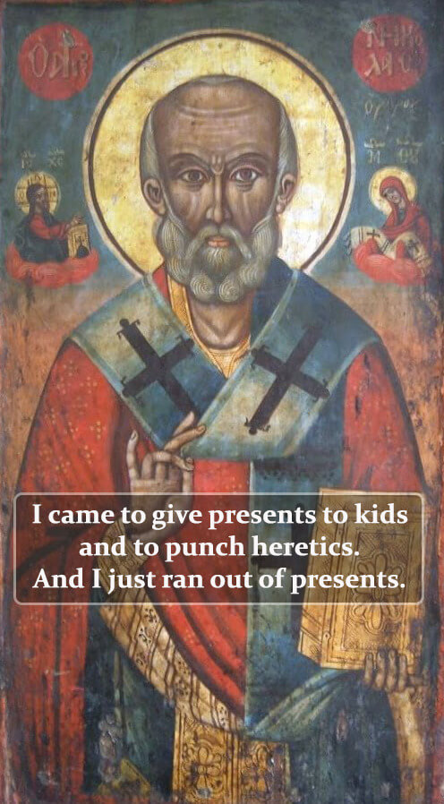
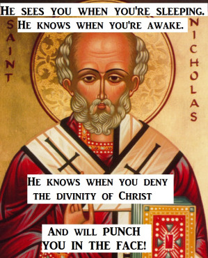
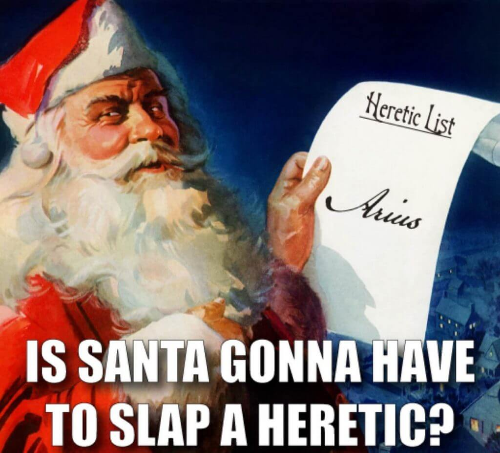

As is common knowledge, the idea of [Santa Claus](https://en.wikipedia.org/wiki/Santa_Claus) is built from a historical figure, [Saint Nicholas](https://www.stnicholascenter.org/) .

What not everyone knows is that there is a story about Saint Nicholas and the [first ecumenical council](https://en.wikipedia.org/wiki/Saint_Nicholas).

In 325 AD, there was a meeting with a representative majority of the bishops of the Christian world, to discuss so-called [Arianism](https://pt.wikipedia.org/wiki/Arianism), which was growing in popularity. This idea, so called because of its founder [Arius](https://en.wikipedia.org/wiki/Arius), said that [Jesus was not God](2023/09/the-divinity-of-christ/), but rather a semi-god. A being created by the true God, the God-Father.

The story [featured on the Saint Nicholas website](https://www.stnicholascenter.org/who-is-st-nicholas/stories-legends/traditional-stories/life-of-nicholas/bishop-nicholas-loses-his-cool) says that during the discussion, while Arius defended his position, Nicholas could not bear to hear so much heresy that he stood up and slapped his opponent in the face.

The story was later changed to a punch instead of a slap. It's possibly made up, but fun, and has given rise to some funny memes...

- 
    
- 
    
- 
    
- 
