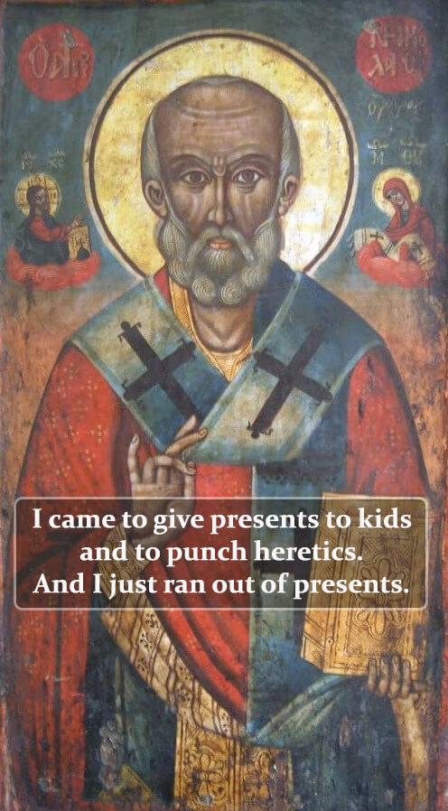
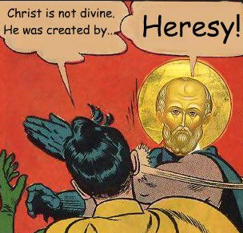
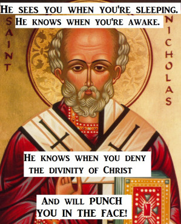
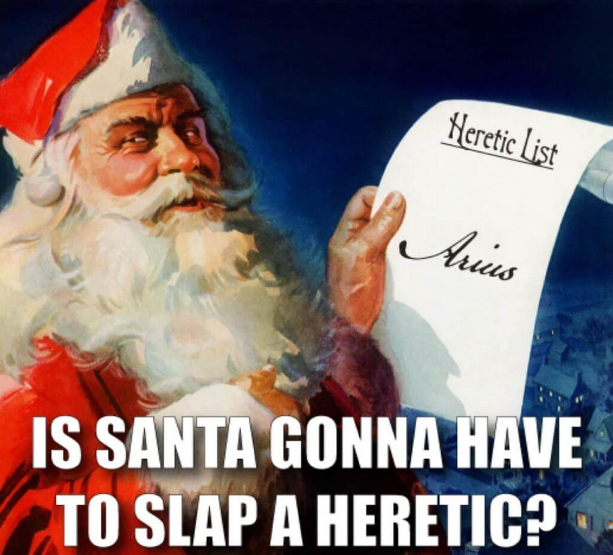

Como é de conhecimento geral, a ideia do [Pai Natal](https://en.wikipedia.org/wiki/Saint_Nicholas) é construída a partir de uma figura histórica, o [São Nicolau.](https://www.stnicholascenter.org/) O que nem todos sabem é que há uma história sobre o São Nicolau e o [primeiro concílio ecuménico](https://pt.wikipedia.org/wiki/Primeiro_Conc%C3%ADlio_de_Niceia).

Em 325 AD, houve um encontro com uma maioria representativa dos bispos do mundo cristão, para discutir chamada [arianismo](https://pt.wikipedia.org/wiki/Arianismo), que estava a crescer em popularidade. Esta ideia, assim chamada por causa do seu fundador [Ário](https://pt.wikipedia.org/wiki/%C3%81rio), dizia que [Jesus não era Deus](/pt/2023/09/a-divindade-de-cristo), mas sim um semi-deus. Um ser criado pelo Deus verdadeiro, o Deus-Pai.

A história [apresentada no site do São Nicolau](https://www.stnicholascenter.org/who-is-st-nicholas/stories-legends/traditional-stories/life-of-nicholas/bishop-nicholas-loses-his-cool) conta que durante a discussão, enquanto Ário defendia a sua posição, Nicolau não aguentou ouvir tanta heresia que se levantou e deu uma bofetada na cara do seu oponente.

A história mais tarde foi alterada para um murro em vez da bofetada. É possivelmente inventada, mas divertida, e deu origem a uns memes engraçados...

- 
    
- 
    
- 
    
- 
