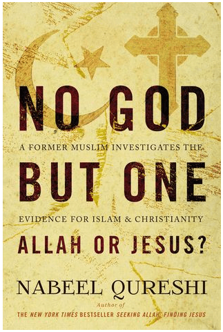

_Is it really worth sacrificing everything for the truth? The answer is simple: It depends on the value of the truth._

Jesus vs Mohamed, Quran vs Bible, Islam vs Christianity. What would an independent observer conclude about these comparisons?

[Great book](https://www.goodreads.com/book/show/27840555-no-god-but-one) by the late Nabeel Qureshi. Leaves me wondering if I would sacrifice everything for the truth...
