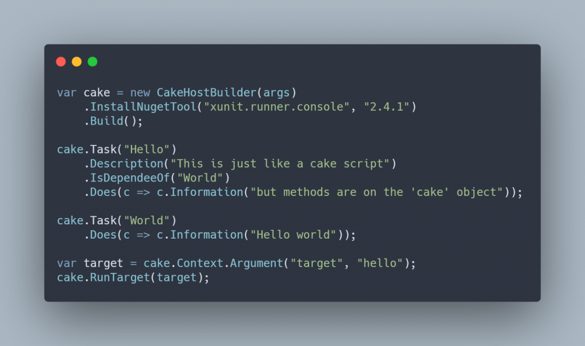
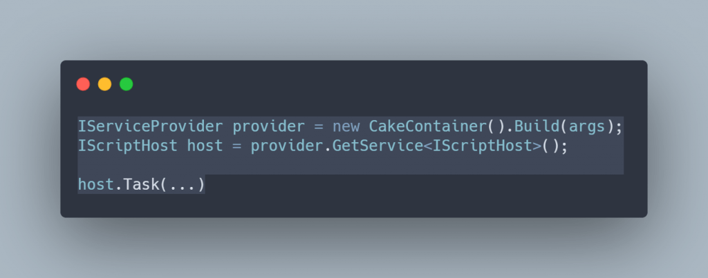
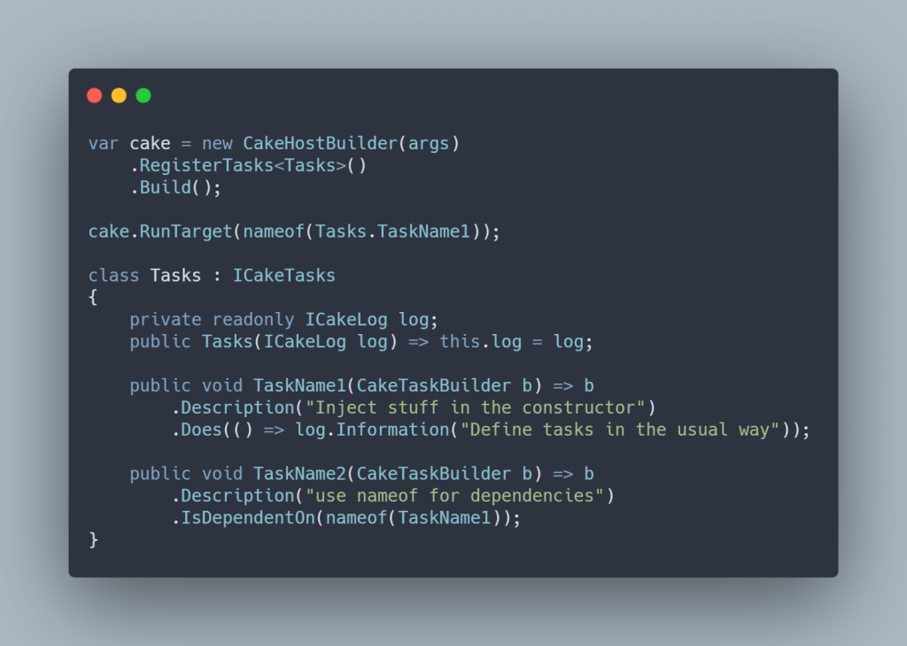

I wanted to run [Cake](https://cakebuild.net/) inside a console app, without the penalty of pre-processing the .cake DSL, and have the all the power of an IDE (refactorings, find usages,...). I had 2 possibilities:

1. [Cake.Frosting](https://cakebuild.net/docs/running-builds/runners/cake-frosting)  
    This was the best option, but I really didn't like a couple of things like, the ceremony of writing a class for each task or using attributes for describing tasks instead of the fluent syntax of cake scripts
2. [Cake.Bridge](https://github.com/devlead/Cake.Bridge/)  
    This was more in line with what I wanted, but It missed some stuff like tool installing.

So, it was time to roll up my sleeves and get to work. Presenting [Cake.Console](https://github.com/pitermarx/Cake.Console)!

It's a fairly simple project, but I learned a lot about cake's internals.

Cake has an architecture where every piece of functionality is behind an interface and is injected into objects as needed. Then the registering of interfaces into implementations is defined in "Modules". There is a _ICakeContainerRegistrar_ Object that can receive registrations. I needed to implement a registrar if I wanted to take advantage of internal implementations of interfaces from Cake. So I did create a [CakeContainer](https://github.com/pitermarx/Cake.Console/blob/main/Cake.Console/Internals/CakeContainer.cs) that can receive registrations from Cake.Core and Cake.Nuget modules and then create an [IServiceProvider](https://docs.microsoft.com/en-us/dotnet/api/system.iserviceprovider?view=net-5.0) that can instantiate the needed parts of cake.

After understanding this part, It's just a case of wiring some moving parts and I got it to work. The only "hand coded" part was the parsing of commandline arguments, which was done very naively.

What I got was a piece of code that can give me a IScriptHost object, which is the implicit object that is called on .cake scripts when we define Tasks or use Addins.

I still needed one thing, the installation of [tools](https://cakebuild.net/docs/writing-builds/tools/). I then added 2 things, a way to register stuff into the _ICakeContainerRegistrar_ and a special interface _IHostBuilderBehaviour_ that executes a Run() method before returning the IScriptHost, to add functionality into Cake.Console. What I got was a very simple CakeHostBuilder that I can then extend via extension methods.

With all this infrastructure in place I then added 5 extensions that fulfilled all my needs in this project

## **Installing Tools**

I added the interface _ICakeToolReference_, and the _[ToolInstallerBehaviour](https://github.com/pitermarx/Cake.Console/blob/main/Cake.Console/HostBuilderBehaviours/ToolInstallerBehaviour.cs)_. Created also a _[CakeNugetTool](https://github.com/pitermarx/Cake.Console/blob/main/Cake.Console/Internals/CakeNugetTool.cs)_ class to create the correct Url for a nuget package.  
Then it's just a matter of registering _ICakeToolReference_s into the _ICakeContainerRegistrar_  

## **Tasks from methods**

I added the _ICakeTasks_ interface and the _[TaskRegisteringBehaviour](https://github.com/pitermarx/Cake.Console/blob/main/Cake.Console/HostBuilderBehaviours/TaskRegisteringBehaviour.cs)_, which instantiates the _ICakeTasks_, and calls all the methods that receive a _CakeTaskBuilder_. This CakeTaskBuilder will already have created the Task with the same name as the method.

## **Changing WorkingDirectory**

Once more I added the _IWorkingDirectory_ interface which has working directory string a and the _[WorkingDirectoryBehaviour](https://github.com/pitermarx/Cake.Console/blob/6842a38b6c/Cake.Console/HostBuilderBehaviours/WorkingDirectoryBehaviour.cs)_, that converts it to an absolute path and changes the working directory. Useful when your build scripts are not in the same tree as the code itself.

**Auto setup context data**

The Setup callback on the _IScriptHost_ can return an object that can then be used in the CakeTaskBuilder extensions. This is called a [Typed Context](https://cakebuild.net/docs/writing-builds/sharing-build-state#typed-context). I wanted a typed context that could tap into the internals of cake, so it needed to be registered into the _ICakeContainerRegistrar_.

Once more I created a [SetupContextDataBehaviour](https://github.com/pitermarx/Cake.Console/blob/6842a38b6c/Cake.Console/HostBuilderBehaviours/SetupContextDataBehaviour.cs), and I'm good to go. I can even register multiple typed context and use the needed one on different tasks.

**Run target**

I found myself hating that part of the script that reads the "target" from the arguments. It just breaks the fluent vibe from the code! So I extended the _CakeHostBuilder_ to have a Run method that simply reads the target from the arguments and runs it. Putting it all together...

All modesty aside, I really think it is looking great!
