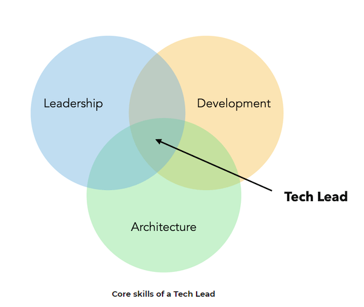

> A Tech Lead is a software engineer responsible for leading a team and alignment of the technical direction.
> 
> [https://www.patkua.com/blog/the-definition-of-a-tech-lead/](https://www.patkua.com/blog/the-definition-of-a-tech-lead/)

Very good article
