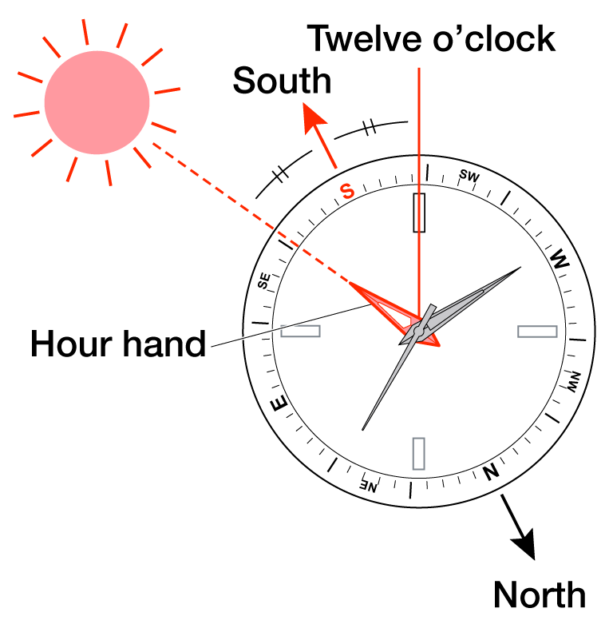

The approximate direction can be determined by comparing the position of the hour hand to the sun.
Keep in mind that these determinations are approximate as there is some discrepancy at different latitudes and in different seasons.

Lay the watch horizontally and align the hour hand of the watch with the direction of the sun. The middle point between the alignment of the sun with the hour hand, and the 12 o’clock position on the dial, approximately indicates south.
Positioning the rotating bezel so that it points south, will then allow you to read other approximate compass directions.