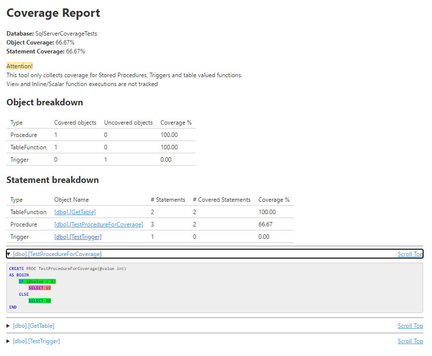
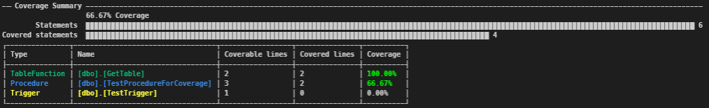

I've developed a tool inspired by the work of [GoEddie](https://github.com/GoEddie/SQLCover) that can collect and report coverage data of SQL code on a SQLServer database.
I've called it - not very creatively - [SqlServerCoverage](https://github.com/pitermarx/SqlServerCoverage).

## Quick start

1. Install dotnet tool: `dotnet tool install sqlservercoverage.commandline -g`
2. Start coverage session: `$id = sql-coverage start --connection-string=$cnx --database=$db`
3. Collect coverage: `sql-coverage collect --connection-string=$cnx --id=$id --summary`
4. Cleanup: `sql-coverage stop --connection-string=$cnx --id=$id`

## Details

This tool allows us to know how much of the stored procedures are covered by some action

It uses [XEvents](https://docs.microsoft.com/en-us/sql/relational-databases/extended-events/extended-events) on sql server to track which statements were used in the time a trace session was open.
Unfortunately Views, Scalar functions and inlined table functions are not trackable via this mecanism. Only Stored procedures, Triggers and Table Valued functions are tracked.

```powershell
$conn = "Data Source=.\SQLEXPRESS;Integrated Security=True"
$db = "DatabaseName"

# start a session and get the ID
$id = dotnet sql-coverage start --connection-string=$conn --database=$db
if ($LASTEXITCODE -ne 0) { throw $id }

# returns a list of session IDs on the server
dotnet sql-coverage list --connection-string=$conn

# now do some stuff on the database

# collect coverage data.
# export an html report, an opencover report, a sonar report and a console summary
$outputDirectory="somewhere"
dotnet sql-coverage collect --connection-string=$conn --id=$id `
  --html --opencover --sonar --summary --output=$outputDirectory

# manual cleanup is necessary to stop the XEvents session
# you can do this
dotnet sql-coverage stop --connection-string=$conn --id=$id
# or stop all sessions on the server
dotnet sql-coverage stop-all --connection-string=$conn
# or stop all sessions if the corresponding db does not exist anymore
dotnet sql-coverage stop-all --connection-string=$conn --only-missing-dbs

```

This is a sample summary from the console and attached is a sample HTML report



This is a screenshot of the terminal summary, created with [Spectre.Console](https://spectreconsole.net/)



The OpenCover xml report also exports the source objects that can then be used by [ReportGenerator](https://danielpalme.github.io/ReportGenerator/) to generate a report

It can also export on the [sonar generic coverage](https://docs.sonarqube.org/latest/analysis/generic-test/) format
