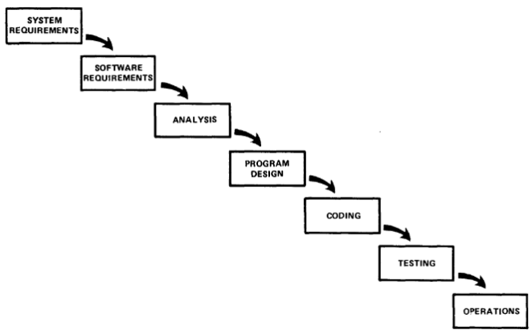
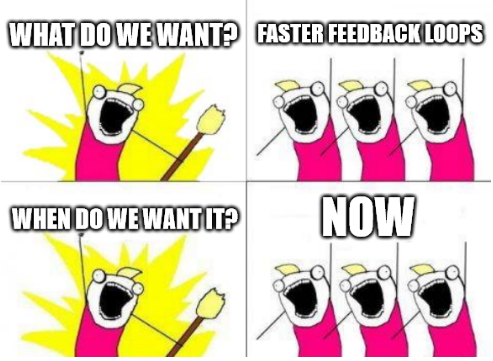

I’ve been thinking recently about feedback loops.

In [control theory](https://en.wikipedia.org/wiki/Control_theory), one way to manage dynamic systems is via feedback loops. Feedback loops in physical control systems are always associated with time delays due to the finite speed of sensing and signal processing. Feedback delay is usually considered to be a source of unstable behavior, and should be minimized as much as possible.

How is this related to software?

It has long ago been acknowledged that managing software systems is best done with cyclic, iterative steps. In fact, [Winston Royce](https://en.wikipedia.org/wiki/Winston_W._Royce), in his 1970 article 'Managing the development of large software systems', said the following, after describing a pure waterfall project plan:

> I believe in this concept, but the implementation described above is risky and invites failure. […] The testing phase which occurs at the end of the development cycle is the first event for which timing, storage, input/output transfers, etc., are experienced as distinguished from analyzed. These phenomena are not precisely analyzable. They are not the solutions to the standard partial differential equations of mathematical physics for instance. Yet if these phenomena fail to satisfy the various external constraints, then invariably a major redesign is required. […] The required design changes are likely to be so disruptive that the software requirements upon which the design is based and which provides the rationale for everything are violated. Either the requirements must be modified, or a substantial change in the design is required. In effect the development process has returned to the origin and one can expect up to a 100% overrun in schedule and/or costs.
>
> — <cite> Winston Royce - [Managing the development of large software systems](https://doi.org/10.7551/mitpress/12274.003.0035) </cite>

## So what?

Royce acknowledged that each phase of the software development lifecycle informed and affected other phases, and not only the one that follows it. They can’t be planned and executed in isolation, thinking simply in terms of inputs and outputs.

If we then know that feedback loops are critical to the success of a software project, we prioritize activities that improve our feedback loops.
One way to do it is to minimize delay or in other words, make it shorter, make it faster, make it continuous. 

The buzz word Agile, when stripped from all the baggage and frameworks that accompany it these days is simply a term that means:

> Do things following a process
>
> At regular intervals stop and evaluate, the things and the process
> 
> Implement changes that improve the things and the process
>
> — <cite> Me - this article </cite>

Being agile means implementing good feedback loops. Loops that inform and affect the way you work and the result of your work.

## What feedback loops?

While agile methodologies and frameworks usually focus on cycles that deliver working software, or additions to working software that add value to the business, there are many other feedback loops that can be implemented and enhanced for faster feedback. Each one of those loops has points where delays are introduced.
With any given piece of code that needs to be implemented, the following are some examples of delay points:

- **Requirements** - How long does it take to get clarification or changes approved to requirements?
- **Analysis** - How long does it take for a developer to understand how to apply the given requirements?
- **Build** - How long does it take to have a code change ready to execute?
- **Deploy** - How long does it take to have a software update/installation applied?
- **Setup** - How long does it take to get the application ready for use?
- **Unit Test** - How long does it take for a single test to be executed?
- **System Tests** - How long does it take to get assurance that all our system tests pass?
- **Acceptance** - How long does it take to get validation from the stakeholders that the change actually implements the desired behavior?
- **Integration** - How long does it take to get a change integrated in a "real world" environment?

When we improve the speed of any delay point, we enable faster feedback, and therefore, the stability of the whole process.

## Simplicity

> Simplicity - the art of maximizing the amount of work not done - is essential.
>
> — <cite> [Principles behind the Agile Manifesto](https://agilemanifesto.org/principles.html) </cite>

One of the sure ways to reduce delays is simplification.
It really bothers me to see unused code, unnecessary processes, and overengineering. So, I make it a priority to simplify as much as possible.

- When things are simpler, they are easy to understand
- When things are simpler, they are quicker to implement
- When things are simpler, they are quicker to test
- When things are simpler, there are fewer opportunities for incorrectness

This is a principle I strongly adhere to, so much that I've written the [10 Commandments of No Code](/2022/02/why-delete-code/).

## Call to action!

Every little step counts. Whenever you see inefficiencies, fix them.
If you find unused code, delete it. If you have unused features, remove them.
If you have overly complex processes, simplify them. 
If you have an idea to improve runtime performance, implement it.

Get continuous feedback at every step of the way.

If you can deploy continually every change, do it!
If you can test continually every change, do it!
If you can build continually every change, do it!

Strive for describing requirements in a series of small incremental improvements.
If you cannot show those small improvements to the end users, use feature flags.

How will YOU improve your feedback loops?