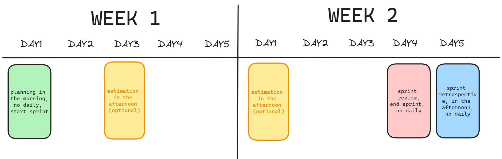
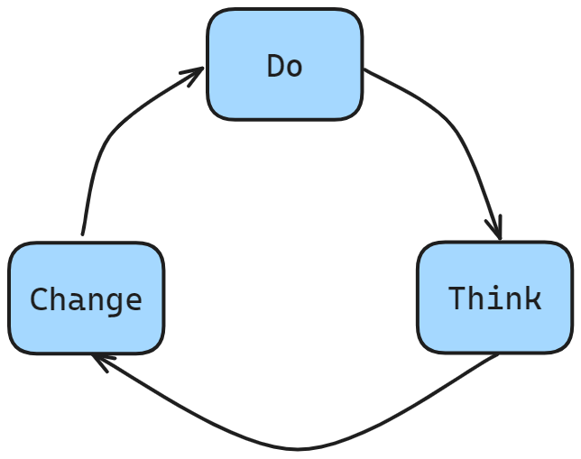

Ahhhh, humans. Such interesting creatures. They like habits and routines, and they work better with predictable schedules.

Unfortunately, life is not always predictable. So we always like to come up with ways to make it less uncertain, and we like to perform rituals, even if they are strictly unnecessary.

The scrum ceremonies on sprints are one of those rituals. 

Planning, Review, Backlog Estimation, Retrospective, Daily Meetings.

If done right, they can be a powerful tool to help teams get into a “cruise speed” cadence of delivering value.

When done poorly, they can be at the very least rituals that give some confort.

While thinking about this, I had some thoughts I would like to share. 

Let’s postulate a sprint length of 2 weeks. Any other value would do, but I chose 2 weeks for 2 reasons:

 - Values of non-weekly intervals (13 days for example) are harder to grok, and to plan ahead. Everyone is used to a weekly schedule.
 - 1 week in my experience is too short for hard tasks, and 3 weeks or more starts to get hard to plan. In my experience 2 weeks is a sweet spot. A good tradeoff.

That said, I would like to propose to your consideration the following sprint structure.

On the first day of the sprint, one should do the planning. Not that the planning has not been thought about until then, but it’s the time where the team gets together to agree upon the sprint’s scope and goals. In this day there is no need to have a daily meeting.

During the sprint, I recommend having 2 timeboxed sessions for the team to discuss and estimate the backlog items. If there is nothing ready for estimation, the meeting can be skipped, but make a slot for it anyway. It’s important to have a regular schedule. 

On the 4th day of the second week, by the end of the day everything should have been completed. What hasn’t been completed needs to spillover to the next sprint. Avoid at all costs increasing the length of the sprint. Accept failures as part of the process and as good learning opportunities. Use either this day or the next to do the sprint review, the meeting where the deliverables of the sprint are presented to all the stakeholders.

On the last day of the sprint, one should have some breathing room, to accommodate to unpredictable circumstances, to start preparing and planning the next sprint, to do administrative tasks, to do work that does not fit neatly into the definition of “sprint work”. In this day it is very important to have the time for the team to get together on the retrospective.

The retrospective is in my mind the single most important ceremony of the scrum process. It’s the retrospective that makes scrum agile. It’s in the retrospective that the team can reflect on what went well on the current sprint and what can be improved on the next sprint.

> Being agile is simply, at regular intervals, stop doing stuff and think about the stuff that you are doing.
> Then after thinking, if there are things you think can improve, try it! Then go back to doing stuff.
>
> - Me
